# PMO Python Data Quality Gate

**Complete SQL Server + Python data pipeline for PMO portfolio reporting.**

This repository contains all 3 milestones of the PMO Controls Lab data layer:

1. **SQL Schema + Load** — normalized 4-table database
2. **Core SQL Queries** — 4 steering-committee reports
3. **Python Data Cleaning** — quality gate before SQL load
---

## What This Pipeline Does

| Milestone | What | Why |
|-----------|------|-----|
| **1** | SQL Server schema (Sponsors, Projects, ProjectSnapshots, EscalationLookup) | Separates project-master data from point-in-time EVM measures |
| **2** | 4 reporting queries | Answers real steering-committee questions |
| **3** | Python data cleaning script | Turns messy exports into clean, audit-ready data |

---

## The Pipeline End-to-End

**Step 1 — Python Cleaning:** `messy_register.csv` → `clean_register.csv` + `data_quality_log.csv`

**Step 2 — SQL Load:** `clean_register.csv` → SQL Server Database (4 tables)

**Step 3 — Reporting:** SQL Queries → Portfolio Reports & Dashboards
---

## Milestone 1 — Schema Design

**The key design decision:** project-master data and point-in-time EVM measures are split into separate tables.

| Table | What It Holds |
|-------|---------------|
| **Sponsors** | Executive reference data (CRO, CFO, etc.) |
| **Projects** | Permanent project facts (name, sponsor, baseline dates/budget) |
| **ProjectSnapshots** | Point-in-time EVM measures (SPI, CPI, RAG, EAC as of a report date) |
| **EscalationLookup** | Standalone governance reference |

### Screenshots

**Schema Diagram**
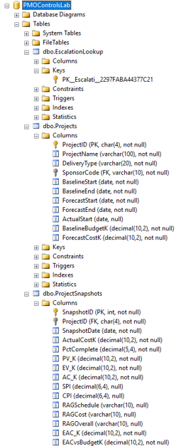

**Database Diagram**
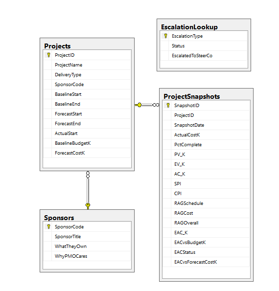

**Row Count Validation**
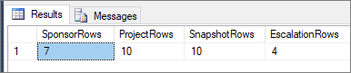

**NULL Handling (not-started projects)**
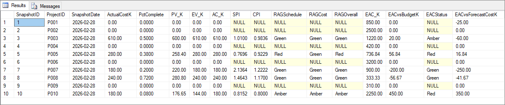

---

## Milestone 2 — Core SQL Queries

Four queries, each answering a question a steering committee actually asks:

| Query | Question |
|-------|----------|
| **RAG Rollup** | "How healthy is the portfolio, and how much budget is in each bucket?" |
| **SPI/CPI Outliers** | "Which started projects are behind schedule or over cost?" |
| **EAC Variance** | "Where is forecast cost diverging from budget?" |
| **EAC Variance by Sponsor** | "Which executive has the largest cost exposure?" |

### Screenshots

**RAG Rollup**
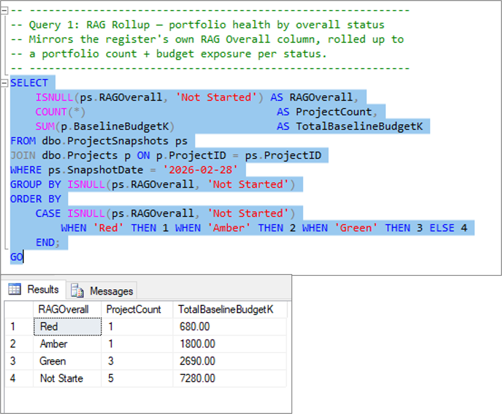

**SPI/CPI Outliers**
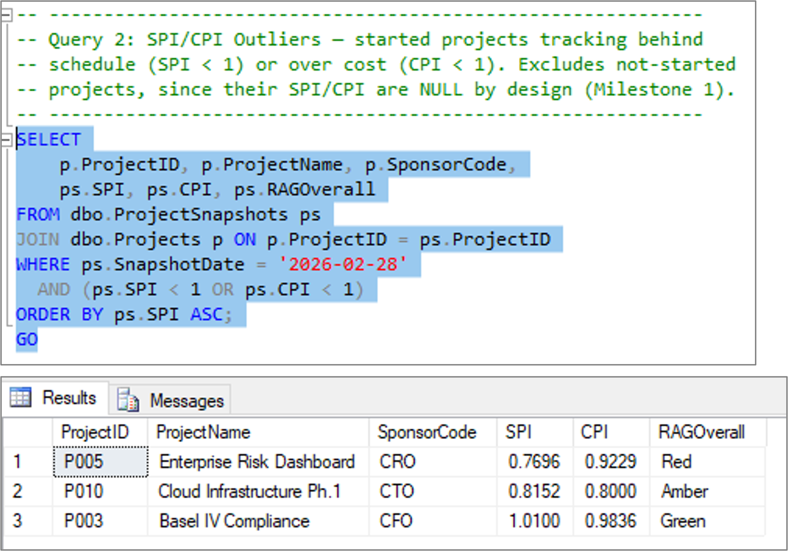

**EAC Variance**
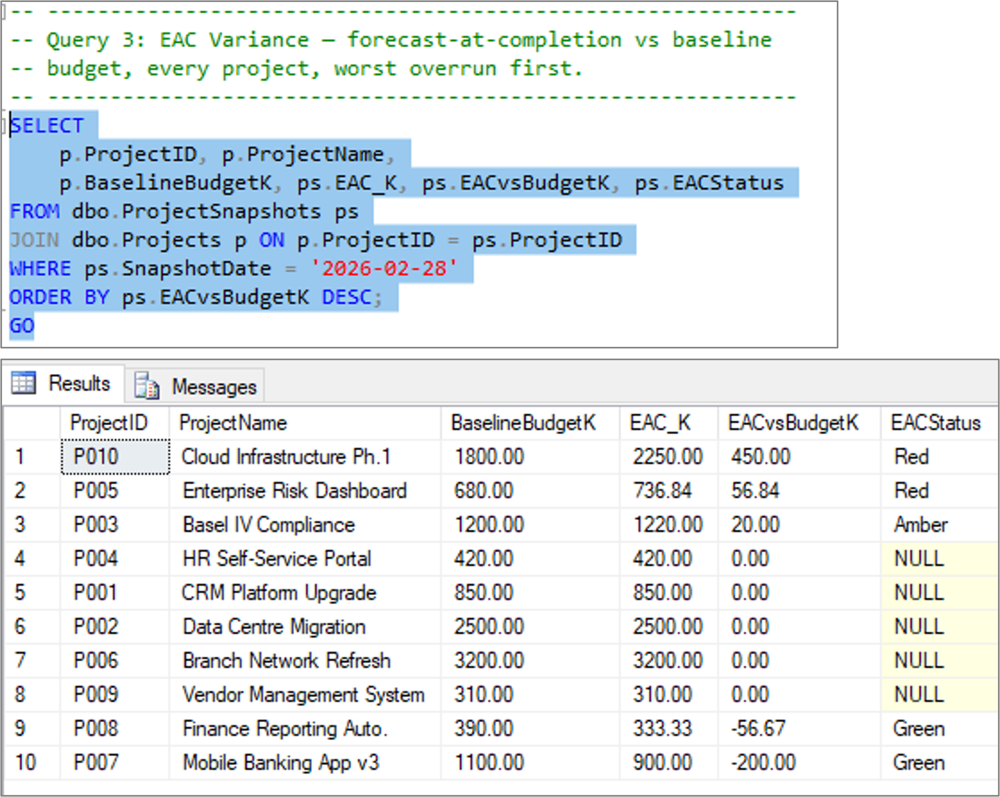

**EAC Variance by Sponsor**
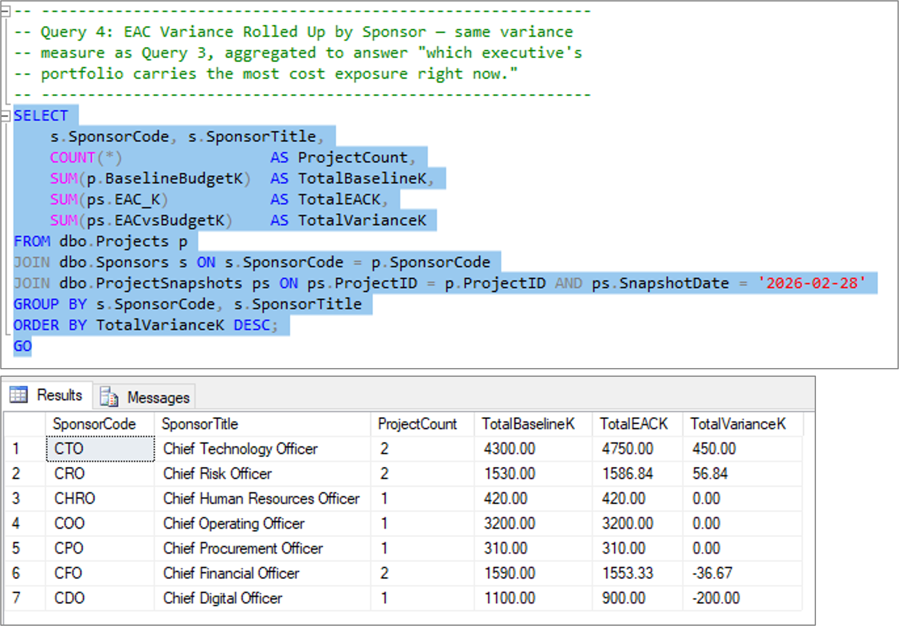
---

## Milestone 3 — Python Data Cleaning

Quality gate that sits before SQL Server load. Takes messy CSV (11 rows) and produces clean CSV + audit log.

**The key judgment call:** a blank field is not automatically a data quality problem.

| Project | SPI | CPI | Cost | Judgment |
|---------|-----|-----|------|----------|
| P001 | NULL | NULL | Blank | ✅ Fine — not started |
| P010 | 0.8152 | 0.8 | Blank | ⚠️ Real gap — started project missing cost |

### Screenshots

**Terminal Output**
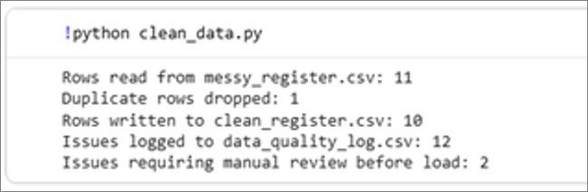

**Before vs After**
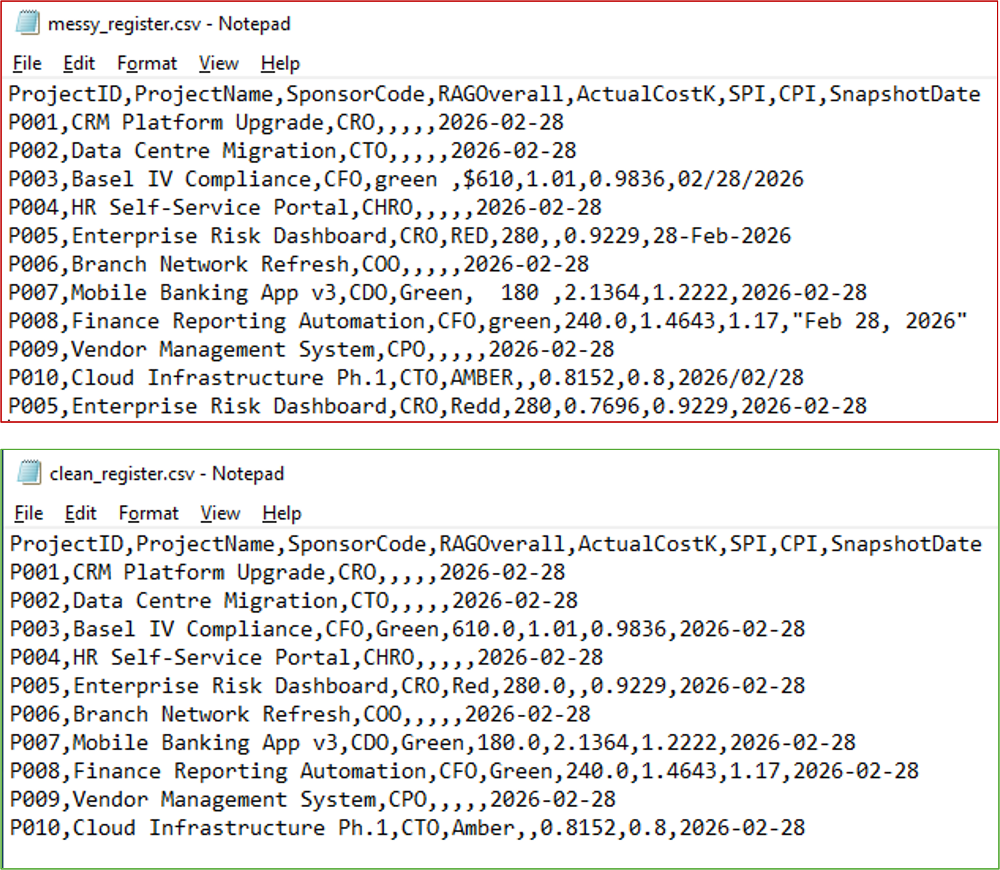

**Data Quality Log**
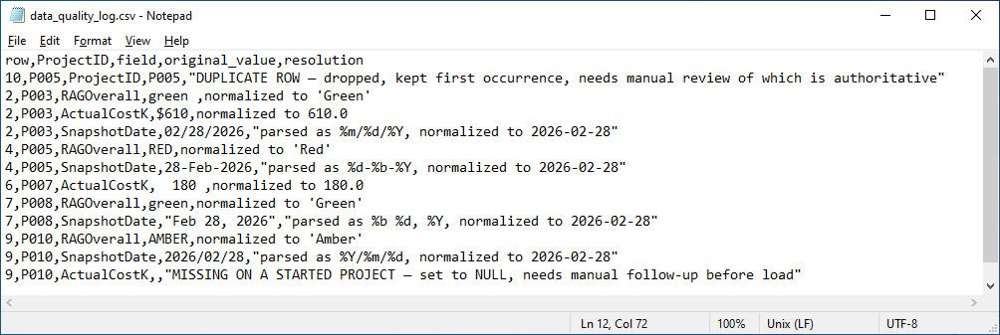

---

## Repository Structure
pmo-python-data-quality-gate/

├── README.md

├── screenshots/ # All 11 execution screenshots

├── sql/

│ ├── schema.sql # Milestone 1

│ ├── load_data.sql # Milestone 1

│ └── milestone2_queries.sql # Milestone 2

├── src/

│ └── clean_data.py # Milestone 3

└── data/

├── messy_register.csv
├── clean_register.csv
└── data_quality_log.csv

