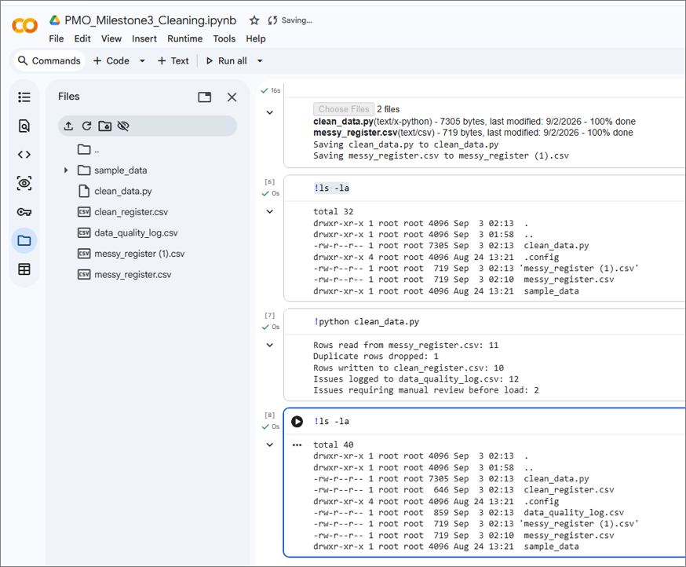
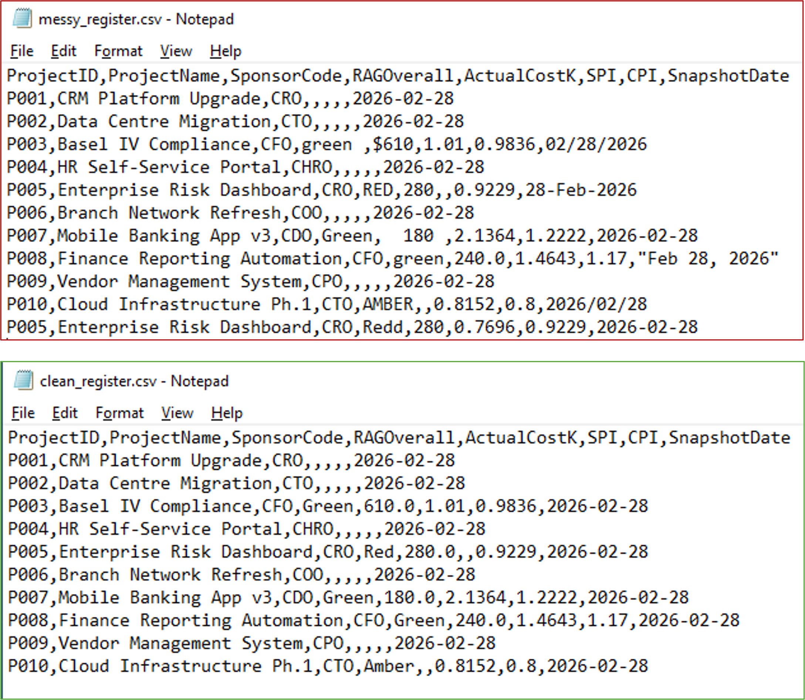
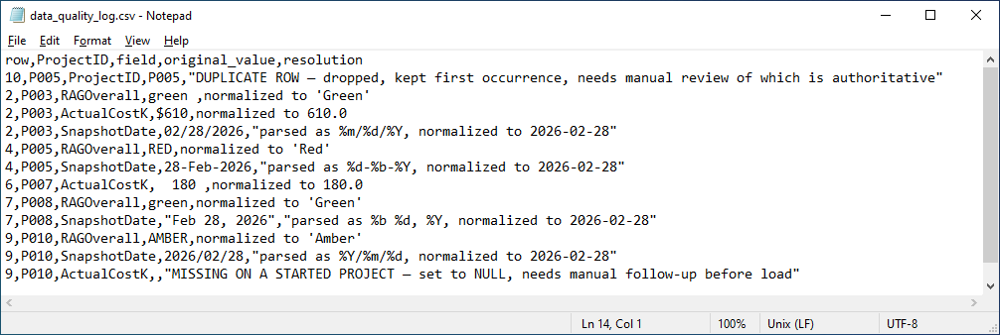

# PMO Python Data Quality Gate

A data quality pipeline that cleans messy project exports before SQL Server load.

---

## The Problem

Weekly project register exports arrive with inconsistent data:
- RAG status: `green`, `RED`, `AMBER`, `Redd` (typo)
- Currency: `$610`, `  180  `, `240.0`
- Dates: 5 different formats in one file
- Duplicate: P005 appears twice
- Blank cost on a started project (P010) — invisible without cross-field checks

---

## What It Does

| Issue | Fix |
|-------|-----|
| `green` / `RED` / `AMBER` | Normalized to `Green` / `Red` / `Amber` |
| `Redd` | Flagged for human review — never auto-corrected |
| `$610` / `  180  ` | Stripped to `610.0` / `180.0` |
| 5 date formats | Parsed to `YYYY-MM-DD` using explicit format list |
| Duplicate P005 | Dropped, logged, flagged for review |
| Blank cost on P010 | Detected as real data gap (SPI/CPI exist) |

---

## The Key Judgment Call

A blank `ActualCostK` means different things:

| Project | SPI | CPI | Cost | Meaning |
|---------|-----|-----|------|---------|
| P001 | NULL | NULL | Blank | ✅ Fine — not started |
| P010 | 0.8152 | 0.8 | Blank | ⚠️ Real gap — started project missing cost |

This requires looking across columns — no single-field rule can catch it.

---

## Results
Rows read: 11
Duplicates dropped: 1
Clean rows written: 10
Issues logged: 12
Manual review needed: 2

### Screenshots

**Terminal Output**

**Before vs After**

**Data Quality Log**

---

## Skills Demonstrated

- Python / pandas — production data cleaning
- Data quality — controlled vocabularies, cross-field validation
- PMO domain — RAG status, SPI/CPI, portfolio reporting
- Judgment — knowing what to auto-fix vs. what to flag for humans
- Restraint — single script, no over-engineering

---

## Context

This is one milestone in a larger PMO Controls Lab portfolio:

1. **SQL Schema** — normalized sponsors, projects, snapshots
2. **Data Load** — load scripts for SQL Server
3. **This repo** — data quality gate (pre-load)
4. **Next** — SQL analytics for portfolio health dashboards

---

## PMO Framing

> *"I built this to know exactly what 'clean data' means before presenting to a steering committee — which blanks are fine, which are gaps, which values got touched. That's PMO accountability, not data engineering."*
